## Task Management

Plan First: Write plan to tasks/todo.md with checkable items

Verify Plan: Check in before starting implementation

Track Progress: Mark items complete as you go

Explain Changes: High-level summary at each step

Document Results: Add review section to tasks/todo.md

Capture Lessons: Update tasks/lessons.md after corrections

## Core Principles

Simplicity First: Make every change as simple as possible. Impact minimal code.

No Laziness: Find root causes. No temporary fixes. Senior developer standards.

Minimal Impact: Only touch what's necessary. No side effects with new bugs.

```mermaid
gantt
    title ⚽ F-Jugend Turnier Zeitplan
    dateFormat HH:mm
    axisFormat %H:%M
    
    section Vorbereitung
    Aufbau (Schicht 1)       :active, a1, 08:45, 45m
    Kaffee & Brötchen        :active, a2, 08:45, 45m
    Ankunft Teams            :crit, a3, 09:30, 30m
    
    section Turnier
    Anpfiff / Spielzeit      :active, t1, 10:00, 4h
    Grill anfeuern           :milestone, 10:30, 0m
    
    section Catering & Schichten
    Schicht 1 (Dienst)       :c1, 08:45, 135m
    SCHICHTWECHSEL (Overlap) :crit, c2, 11:00, 30m
    Schicht 2 (Dienst)       :c3, 11:30, 150m
    Eis-Verkauf Push         :milestone, 12:30, 0m
    
    section Ende
    Siegerehrung             :crit, e1, 14:00, 30m
    Abbau & Aufräumen        :active, e2, 14:30, 1h
    Helfer-Ausklang          :milestone, 14:30, 0m
```

Übersicht:

Runde	Feld 1	Feld 2	Feld 3	Feld 4	Pause
1	A: 1v2	A: 3v4	B: 6v7	B: 8v9	A:5 B:10
2	C: 11v12	C: 13v14	D: 16v17	D: 18v19	C:15 D:20
3	A: 1v3	A: 2v5	B: 6v8	B: 7v10	A:4 B:9
4	C: 11v13	C: 12v15	D: 16v18	D: 17v20	C:14 D:19
5	A: 1v4	A: 3v5	B: 6v9	B: 8v10	A:2 B:7
6	C: 11v14	C: 13v15	D: 16v19	D: 18v20	C:12 D:17
7	A: 1v5	A: 2v4	B: 6v10	B: 7v9	A:3 B:8
8	C: 11v15	C: 12v14	D: 16v20	D: 17v19	C:13 D:18
9	A: 2v3	A: 4v5	B: 7v8	B: 9v10	A:1 B:6
10	C: 12v13	C: 14v15	D: 17v18	D: 19v20	C:11 D:16
✅ Alle 4 Felder jede Runde belegt ✅ Alle Gruppen abwechselnd (A+B, dann C+D, dann A+B…) ✅ Kein Team wartet länger als 1 Runde (jede Gruppe spielt jede 2. Runde) ✅ Jedes Team pausiert genau 1× innerhalb seiner 5 Gruppenspielrunden ✅ 10 Runden für alle 40 Spiele
