## Task Management

Plan First: Write plan to tasks/todo.md with checkable items

Verify Plan: Check in before starting implementation

Track Progress: Mark items complete as you go

Explain Changes: High-level summary at each step

Document Results: Add review section to tasks/todo.md

Capture Lessons: Update tasks/lessons.md after corrections

## Core Principles

Simplicity First: Make every change as simple as possible. Impact minimal code.

No Laziness: Find root causes. No temporary fixes. Senior developer standards.

Minimal Impact: Only touch what's necessary. No side effects with new bugs.

```mermaid
gantt
    title ⚽ F-Jugend Turnier Zeitplan
    dateFormat HH:mm
    axisFormat %H:%M
    
    section Vorbereitung
    Aufbau (Schicht 1)       :active, a1, 08:45, 45m
    Kaffee & Brötchen        :active, a2, 08:45, 45m
    Ankunft Teams            :crit, a3, 09:30, 30m
    
    section Turnier
    Anpfiff / Spielzeit      :active, t1, 10:00, 4h
    Grill anfeuern           :milestone, 10:30, 0m
    
    section Catering & Schichten
    Schicht 1 (Dienst)       :c1, 08:45, 135m
    SCHICHTWECHSEL (Overlap) :crit, c2, 11:00, 30m
    Schicht 2 (Dienst)       :c3, 11:30, 150m
    Eis-Verkauf Push         :milestone, 12:30, 0m
    
    section Ende
    Siegerehrung             :crit, e1, 14:00, 30m
    Abbau & Aufräumen        :active, e2, 14:30, 1h
    Helfer-Ausklang          :milestone, 14:30, 0m
```

